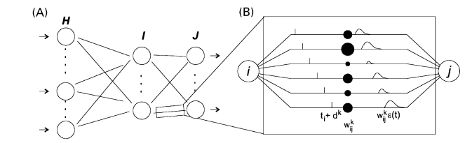

# User Manual 

This manual aims to provide primary steps to construct and train the spiking neural networks with different training algorithms. First, we list training approaches for SNN. Next, for each training algorithm belonging to the corresponding approach, we will provide a detailed description and a procedure to train SNNs by using the n3ml package


## SNN training approaches 
To train SNNs, the training algorithms can be categorized into three main approaches:
 biological-based learning rules, approximation of spike-based backpropagation, 
 and ANN-SNN conversion methodologies. 
 
## Biological-based learning approach
Inspired by the bio-neural system, learning rules in this approach attempt to train 
 SNN by modifying the synaptic strength based on local learning rules (STDP, R-STDP) in an 
 unsupervised/semi-supervised manner.   
#### Objective

Pros: Biologically plausible

Cons: Low accuracy compared with the remaining training appproachs.

#### Synaptic Time Dependent Plasticity (STDP) learning rule

##### Description
Spike-timing-dependent-plasticity (STDP) [1] trains spiking neural networks by 
adjusting the connection weight between every particular pair of pre and 
postsynaptic neurons based on the relative timing of output and input spikes.
The update rule is fomulated as follows

<a href="https://www.codecogs.com/eqnedit.php?latex=\Delta&space;W&space;=&space;\alpha(x_{pre}-x_{tar})(w_{max}-w)^{\mu}" target="_blank"></a>

where <a href="https://www.codecogs.com/eqnedit.php?latex=\Delta&space;W" target="_blank"></a>
 is the weight change over time step, <a href="https://www.codecogs.com/eqnedit.php?latex=\alpha" target="_blank"></a>
 is the learning rate, <a href="https://www.codecogs.com/eqnedit.php?latex=w_{max}" target="_blank"></a>
is the maximum weight and <a href="https://www.codecogs.com/eqnedit.php?latex=\mu" target="_blank"></a>
determine the dependence of the update on the previous weight. 
<a href="https://www.codecogs.com/eqnedit.php?latex=x_{tar}" target="_blank"></a>
and <a href="https://www.codecogs.com/eqnedit.php?latex=x_{pre}" target="_blank"></a>
model the history trace of postsynaptic and presynaptic spikes respectively.     

##### Implementation with n3ml

To train the spiking neuron network in [1] with STDP algorithm on MNIST task:

###### Step1: Prepare dataset:
Using Pytorch wrapping to load MNIST dataset.

```
import torchvision
from torchvision.transforms import transforms

train_loader = torch.utils.data.DataLoader(
    torchvision.datasets.MNIST(
        opt.data,
        train=True,
        transform=torchvision.transforms.Compose([
            transforms.ToTensor(), transforms.Lambda(lambda x: x * 32 * 4)])),
    batch_size=opt.batch_size,
    shuffle=True)
```
 ###### Step2: Define encoding method:
Encoding is the first step in the whole SNN training process. It's responsible for 
converting input pixel intensity into a binary sequence of spike events before feeding 
into SNN. Specifically, here input intensities are converted into Poisson spike trains 
whose average firing rate is proportional to the pixel intensity ( the higher the pixel 
intensity, the higher the spike count).
   
```
from n3ml.encoder import PoissonEncoder
# Define an encoder to generate spike train for an image
encoder = PoissonEncoder(opt.time_interval)
```

###### Step3: Define SNN model:

In n3ml, the SNN model in [1] is available for use. Here we define the model as follows 

```
from n3ml.model import DiehlAndCook2015
# Define a model
model = DiehlAndCook2015(neurons=100)
```

###### Step4: Training the defined model with STDP algorithm:

```
for epoch in range(opt.num_epochs):
    start = time.time()
    for step, (images, labels) in enumerate(train_loader):
        # Initialize a model
        model.init_param()

        # Encode images into spiked_images 
        images = images.view(1, 28, 28)
        spiked_images = encoder(images)
        spiked_images = spiked_images.view(opt.time_interval, -1)
        # spiked_images = spiked_images.cuda()

        # Train a model
        for t in range(opt.time_interval):
            
            # feed forward to SNN
            model.run({'inp': spiked_images[t]})

            # Update weights using STDP learning rule
            model.update()

        # Normalize weights
        model.normalize()
        
        #Observe how the weights are changing during training process
        w = model.xe.w.detach().cpu().numpy()
        fig, mat = plot(fig, mat, w)       
```
###### Step5: Putting them together:

A completed sample is provided in the test directory. 

To train SNN in [1] with STDP, please run the following file:
 ```
test/test_stdp.py
```

To test the trained SNN with STDP, please run the following files in order :
 ```
test/test_stdp_assign.py
test/test_stdp_infer.py
```      

### ANN-SNN Conversion approach
Inherited from the superior success in training ANNs, ANN-SNN conversion methodologies train SNNs by converting a trained 
ANN composing of Rectifed Linear Units (ReLU) to SNN consisting of integrate-and-fre (IF) neurons with appropriate fring thresholds. 

Pros: High performance, Low computational cost compared with direct training approach

Cons: Long latency is required, the ANN must satisfy some constraint conditions

#### Diehl et al.Fast-Classifying, High-Accuracy Spiking Deep Networks Through Weight and Threshold Balancing (2015) 

##### Description
Maximum activation-based conversion method was first introduced in [2]. The primary principle of this method is the fring rates of spiking neurons are proportional to activations of analog neurons:
- First, a traditional artificial neural network composed of ReLU neurons is trained by using the backpropagation algorithm. 
- The trained weights in CNN then are transferred directly to the corresponding SNN model
- The **activation-based threshold balancing technique** in [2] is applied to assign fring thresholds to the IF neurons in the SNN. Note that, this assignment is performed at each layer independently based on the corresponding maximum activation.
- In the inference phase of SNN, each input sample is encoded into spike trains before feeding into SNN for spike count-based classification. 

##### Implementation with n3ml

To train the spiking neuron network in [2] with on MNIST task:

###### Step1: Prepare dataset:
Using Pytorch wrapping to load MNIST dataset.

```
import torchvision
from torchvision.transforms import transforms

 train_loader = torch.utils.data.DataLoader(
        torchvision.datasets.MNIST(
            data,
            train=True,
            transform=torchvision.transforms.Compose([
                transforms.ToTensor()])),
        batch_size=batch_size,
        shuffle=True)

 val_loader = torch.utils.data.DataLoader(
        torchvision.datasets.MNIST(
            data,
            train=False,
            transform=torchvision.transforms.Compose([
                transforms.ToTensor()])),
        batch_size=batch_size,
        shuffle=False)
```

###### Step2: Define ANN model and training configuration
The ANN model in [2] is available for use. Here we initialize the model and training method as follows  

```
from n3ml.model import Diehl2015

  model = Diehl2015()
    if torch.cuda.is_available():
        model.cuda()

criterion = nn.CrossEntropyLoss()
optimizer = torch.optim.Adam(model.parameters(), lr=0.001)

best_acc = 0

for epoch in range(num_epochs):
    print("epoch: {}".format(epoch))
    train(train_loader, model, criterion, optimizer)

    loss, acc = validate(val_loader, model, criterion)
    print("In test, loss: {} - acc: {}".format(loss, acc))

    if acc > best_acc:
        best_epoch = epoch
        best_acc = acc
        state_dict = {
            'epoch': epoch,
            'best_acc': best_acc,
            'model': model.state_dict(),
        }
        torch.save(state_dict, opt.save)

def train(train_loader, model, criterion, optimizer):
    model.train()

    total_images = 0
    num_corrects = 0
    total_loss = 0

    for step, (images, labels) in enumerate(train_loader):
        if torch.cuda.is_available():
            images = images.cuda()
            labels = labels.cuda()

        outputs = model(images)

        loss = criterion(outputs, labels)

        optimizer.zero_grad()
        loss.backward()
        optimizer.step()

        num_corrects += float(torch.argmax(outputs, dim=1).eq(labels).sum())
        total_loss += float(loss)
        total_images += images.size(0)

def validate(val_loader, model, criterion):
    model.eval()

    total_images = 0
    num_corrects = 0
    total_loss = 0

    with torch.no_grad():
        for step, (images, labels) in enumerate(val_loader):
            if torch.cuda.is_available():
                images = images.cuda()
                labels = labels.cuda()

            outputs = model(images)

            loss = criterion(outputs, labels)

            num_corrects += float(torch.argmax(outputs, dim=1).eq(labels).sum())
            total_loss += float(loss)
            total_images += images.size(0)

    val_loss = total_loss / total_images
    val_acc = num_corrects / total_images
  
```

###### Step2: Define the corresponding SNN model:
The corresponding SNN model of IF neurons in [2] is also available for use. Here we initialize the SNN model as follows  

```
from n3ml.model import Diehl2015, SNN_Diehl2015
snn = SNN_Diehl2015(batch_size=opt.batch_size)
print(snn.batch_size)
snn.eval()
snn.cuda()

```

###### Step3: Transfer directly the trained weights from the trained ANN to SNN:

```
saved_state_dict = torch.load(opt.save)
print(saved_state_dict['epoch'])
print(saved_state_dict['best_acc'])
for index, m in enumerate (saved_state_dict['model']):
    snn.state_dict()[m].copy_(saved_state_dict['model'][m])

```

###### Step4: Assign the firing threshold at each SNN layer:

The threshold balancing technique in [2] is available in n3ml package. 

```
from n3ml.threshold import activation_based
threshold = activation_based(train_loader=train_loader, model=ann)
snn.update_threshold(threshold)

```


###### Step5: Inference in SNN:

```
with torch.no_grad():
    for images, labels in val_loader:
        images = images.cuda()
        labels = labels.cuda()

        outs = snn(images, num_steps=n_timesteps)
        num_corrects += torch.argmax(outs, dim=1).eq(labels).sum(dim=0)
        total_images += images.size(0)

        print("Total images: {} - val. accuracy: {}".format(
            total_images, (num_corrects.float() / total_images).item())
        )
```

###### Step6: Putting them together:

A completed sample is provided in the test directory. 

To train a ANN in [2], please run the following file:
 ```
test_act_based_train.py
```

To train and test the corresponding SNN, please run the following file:
 ```
test/test_act_based_infer.py

```      

#### Sengupta et al. Going Deeper in Spiking Neural Networks: VGG and Residual Architectures (2019) 

##### Description
A conversion method with the proposed threshold balancing technique (Spike-norm) is introduced in [3]. 
- First, a traditional artificial neural network composed of ReLU neurons is trained by using the backpropagation algorithm. 
- The trained weights in CNN then are transferred directly to the corresponding SNN model
- The **spike-norm technique** in [3] is applied to assign fring thresholds to the IF neurons in the SNN. Note that, this assignment is performed at each layer independently based on the maximum summation of weighted input from the Poisson input.
- In the inference phase of SNN, each input sample is encoded into spike trains before feeding into SNN for spike count-based classification. 

##### Implementation with n3ml

To train the spiking neuron network in [2] with on CIFAR10 task:

###### Step1: Prepare dataset:
Using Pytorch wrapping to load MNIST dataset.

```
import torchvision
from torchvision.transforms import transforms

     train_loader = torch.utils.data.DataLoader(
        torchvision.datasets.CIFAR10(
            data,
            train=True,
            transform=torchvision.transforms.Compose([
                transforms.RandomCrop(32, padding=4),
                transforms.RandomHorizontalFlip(),
                transforms.ToTensor(),
                transforms.Normalize((0.4914, 0.4822, 0.4465), (0.2023, 0.1994, 0.2010))])),
        batch_size=opt.batch_size,
        shuffle=True)

    val_loader = torch.utils.data.DataLoader(
        torchvision.datasets.CIFAR10(
            data,
            train=False,
            transform=torchvision.transforms.Compose([
                transforms.ToTensor(),
                transforms.Normalize((0.4914, 0.4822, 0.4465), (0.2023, 0.1994, 0.2010))])),
        batch_size=opt.batch_size,
        shuffle=False)
```

###### Step2: Define ANN model and training configuration
The VGG16 model is used in [3] is available for use. Here we initialize the model and a training method as follows  

```
from n3ml.model import VGG16

model = VGG16()
if torch.cuda.is_available():
model.cuda()
criterion = nn.CrossEntropyLoss()
optimizer = torch.optim.Adam(model.parameters(), lr=0.001)

best_acc = 0

for epoch in range(num_epochs):
    print("epoch: {}".format(epoch))
    train(train_loader, model, criterion, optimizer)

    loss, acc = validate(val_loader, model, criterion)
    print("In test, loss: {} - acc: {}".format(loss, acc))

    if acc > best_acc:
        best_epoch = epoch
        best_acc = acc
        state_dict = {
            'epoch': epoch,
            'best_acc': best_acc,
            'model': model.state_dict(),
        }
        torch.save(state_dict, opt.save)

def train(train_loader, model, criterion, optimizer):
    model.train()

    total_images = 0
    num_corrects = 0
    total_loss = 0

    for step, (images, labels) in enumerate(train_loader):
        if torch.cuda.is_available():
            images = images.cuda()
            labels = labels.cuda()

        outputs = model(images)

        loss = criterion(outputs, labels)

        optimizer.zero_grad()
        loss.backward()
        optimizer.step()

        num_corrects += float(torch.argmax(outputs, dim=1).eq(labels).sum())
        total_loss += float(loss)
        total_images += images.size(0)

def validate(val_loader, model, criterion):
    model.eval()

    total_images = 0
    num_corrects = 0
    total_loss = 0

    with torch.no_grad():
        for step, (images, labels) in enumerate(val_loader):
            if torch.cuda.is_available():
                images = images.cuda()
                labels = labels.cuda()

            outputs = model(images)

            loss = criterion(outputs, labels)

            num_corrects += float(torch.argmax(outputs, dim=1).eq(labels).sum())
            total_loss += float(loss)
            total_images += images.size(0)

    val_loss = total_loss / total_images
    val_acc = num_corrects / total_images
  
```

###### Step2: Define the corresponding SNN model:
The corresponding SNN model of IF neurons is also available for use. Here we initialize the SNN model as follows  

```
from n3ml.model import VGG16, SVGG16
snn = SVGG16(ann, batch_size=opt.batch_size)
snn.eval()

```

###### Step3: Transfer directly the trained weights from the trained ANN to SNN:

```
saved_state_dict = torch.load(opt.save)
print(saved_state_dict['epoch'])
print(saved_state_dict['best_acc'])
for index, m in enumerate (saved_state_dict['model']):
    snn.state_dict()[m].copy_(saved_state_dict['model'][m])

```

###### Step4: Assign the firing threshold at each SNN layer:

The threshold balancing technique in [3] is available in n3ml package. 

```
from n3ml.threshold import spikenorm
threshold = spikenorm(train_loader=train_loader,
                encoder=lambda x: torch.mul(torch.le(torch.rand_like(x), torch.abs(x)*1.0).float(),
                                            torch.sign(x)),
                model=snn, num_steps=opt.num_steps, scaling_factor=opt.scaling_factor)

snn.update_threshold(threshold)
```


###### Step5: Inference in SNN:

```
with torch.no_grad():
    for images, labels in val_loader:
        images = images.cuda()
        labels = labels.cuda()

        outs = snn(images, num_steps=n_timesteps)
        num_corrects += torch.argmax(outs, dim=1).eq(labels).sum(dim=0)
        total_images += images.size(0)

        print("Total images: {} - val. accuracy: {}".format(
            total_images, (num_corrects.float() / total_images).item())
        )
```

###### Step6: Putting them together:

A completed sample is provided in the test directory. 

To train a ANN in [3], please run the following file:
 ```
test_spikenorm_train.py
```

To train and test the corresponding SNN, please run the following file:
 ```
test/test_spikenorm_infer.py

```    

## Direct training approach
Inspired by the most popular backpropagation algorithm in the traditional ANN, learning algorithms in this approach train SNNs directly by approximating the error backpropagation of spiking neurons. As the result, this approach has shown a better training accuracy than the biological-based training approach but it requires a very high computational cost and is not biologically plausible 
#### Objective

Pros: competitive accuracy compared with ANN

Cons: High computational cost, not biological plausible.

#### Spike-prob algorithm (Bohte, S. M., J. N. Kok, and H. L. Poutre, Error-backpropagation in temporally encoded networks of spiking neurons. Neurocomputing, 48(1-4), 17-37 (2002))  

##### Description
This algorithm is based on an error-backpropagation learning rule suited for supervised learning of spiking neurons that use exact spike time coding. It demonstrates the spiking neurons that can perform complex nonlinear classification in fast temporal coding. 




The spike-prob algorithm can be summarized as follows

 ```
SpikeProb algorithm:


```    


##### Implementation with n3ml

To train the spiking neuron network in [2] with on MNIST task:


